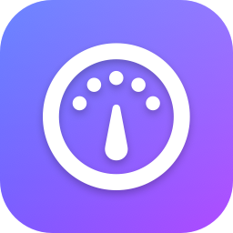
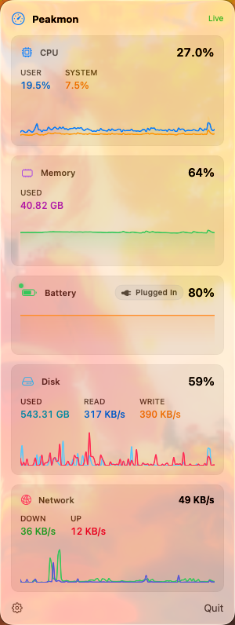
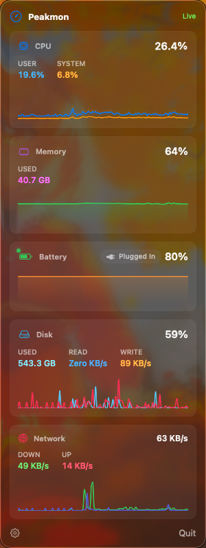
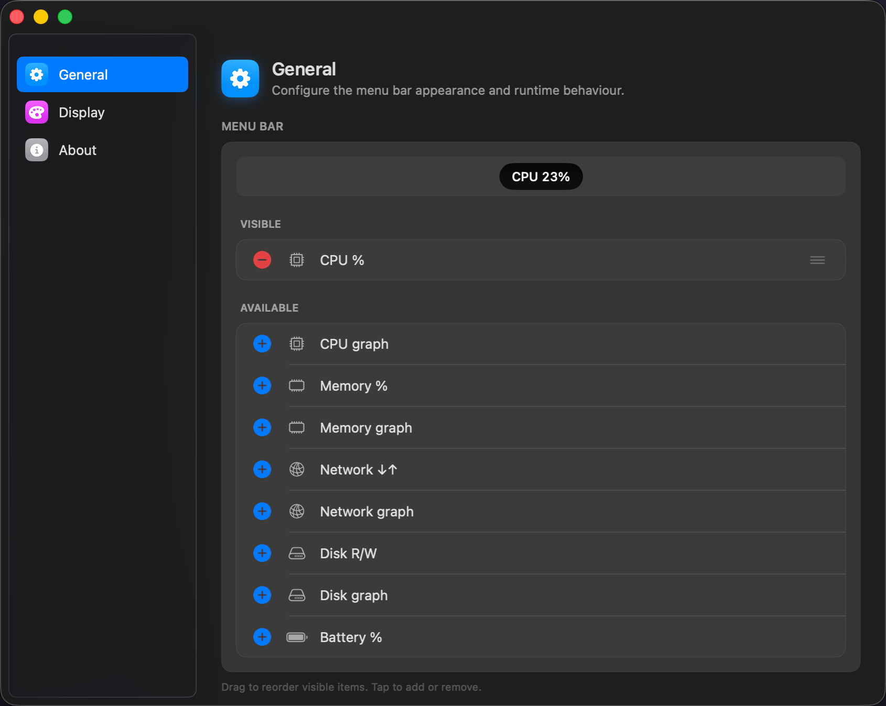

<p align="center">
  
</p>

<h1 align="center">Peakmon</h1>

<p align="center"><b>原生、轻量的 macOS 菜单栏系统监视器。</b></p>

<p align="center"><a href="README.md">English</a> · <a href="README.zh-CN.md">简体中文</a></p>

Peakmon 把 CPU、内存、电量、磁盘、网络等实时指标直接显示在 macOS
菜单栏中 —— 无需打开活动监视器，没有 Electron 外壳，也不上传任何数据。
你可以精确选择想看的内容，自定义每张卡的配色，然后忘了它的存在。

<p align="left">
  
  
  
  
</p>

---

## 截图

<p align="center">
  
  &nbsp;&nbsp;
  
</p>

<p align="center">
  
</p>

## 设计目标

- **原生**：SwiftUI + Swift Concurrency + Swift Charts，不使用
  Combine、不使用 NSTimer，也不引入任何第三方 UI / DI / 日志库。
- **轻量低扰**：常驻菜单栏，安静运行，不打扰你的工作。
- **Apple Silicon 优先**：充分利用统一内存指标、IOReport 通道与
  HID 传感器服务。
- **模块化与开放**：代码拆分为多个本地 Swift Package，新贡献者
  应能在一小时内浏览完整代码库。

## 系统要求

- macOS **26.4** 或更高（跟随最新 SDK；未来可能放宽）。
- Xcode **26.4** 或更高。
- 推荐 Apple Silicon；Intel 尽力支持。

## 构建

```sh
# 用 Xcode 打开并 Run，或：
xcodebuild \
  -project Peakmon.xcodeproj \
  -scheme Peakmon \
  -destination 'platform=macOS' \
  build
```

运行单包测试：

```sh
swift test --package-path Packages/PeakmonCore
```

## 安装

预编译二进制会发布在 [GitHub Releases][releases]。
采用 ad-hoc 签名；**App Sandbox 是被有意关闭的**，因为 Peakmon 需要
读取系统级指标。

Mac App Store 分发不在计划之内。

[releases]: https://github.com/anomalyco/Peakmon/releases

## 仓库结构

```
Peakmon/                 # 应用主体源码（MenuBarExtra 入口）
Packages/
  PeakmonCore/           # 模型、调度器、store、日志门面
  PeakmonCollectors/     # CPU / 内存 / 电池 / 磁盘 / 网络
  PeakmonUI/             # 通用视图（迷你图、hex 颜色辅助…）
```

## 贡献

详见 [`Docs/CONTRIBUTING.md`](Docs/CONTRIBUTING.md):

- Swift 6.2+，macOS 26.4+ SDK。
- SwiftUI + Swift Concurrency。**禁用** Combine，**禁用** NSTimer
  做指标轮询。
- 只有 `MetricsScheduler` 轮询系统，视图层只读 `MetricsStore`。
- 提交前运行 `swiftlint`，CI 用 `--strict`。
- 使用 Conventional Commits（例如：`feat(collectors): add NetworkCollector`）。

## 许可证

Peakmon 基于 [Apache License 2.0](LICENSE) 协议发布。
