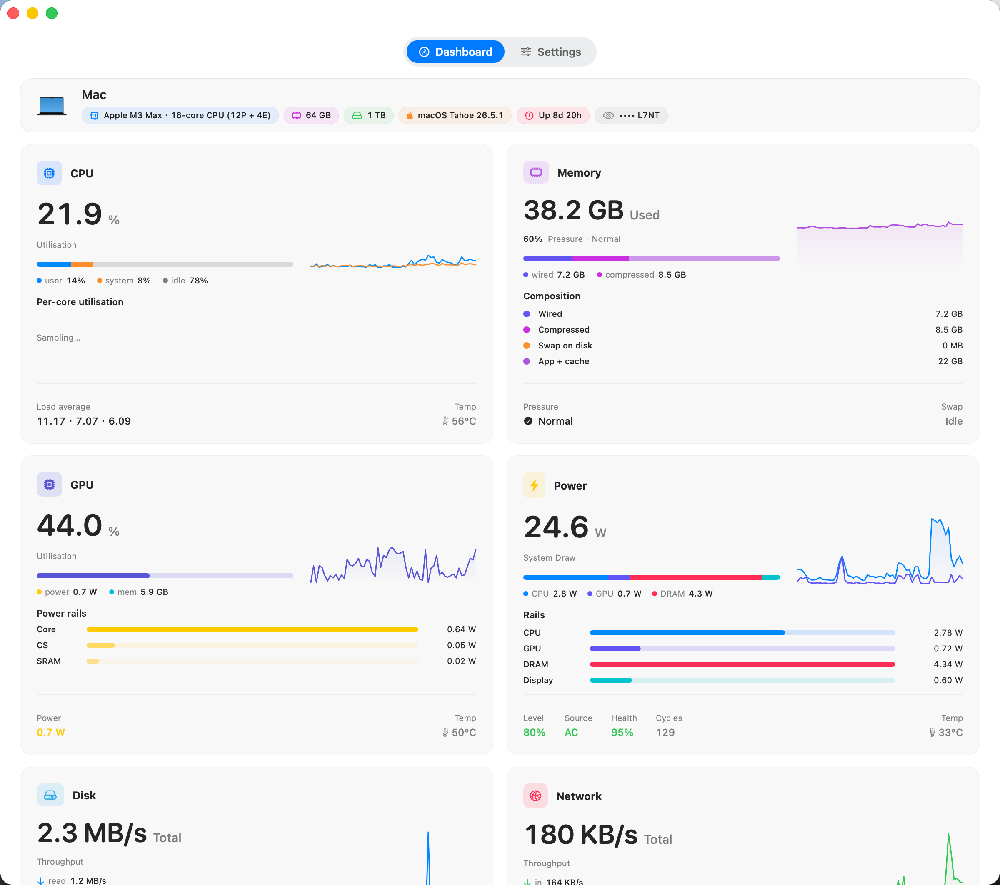
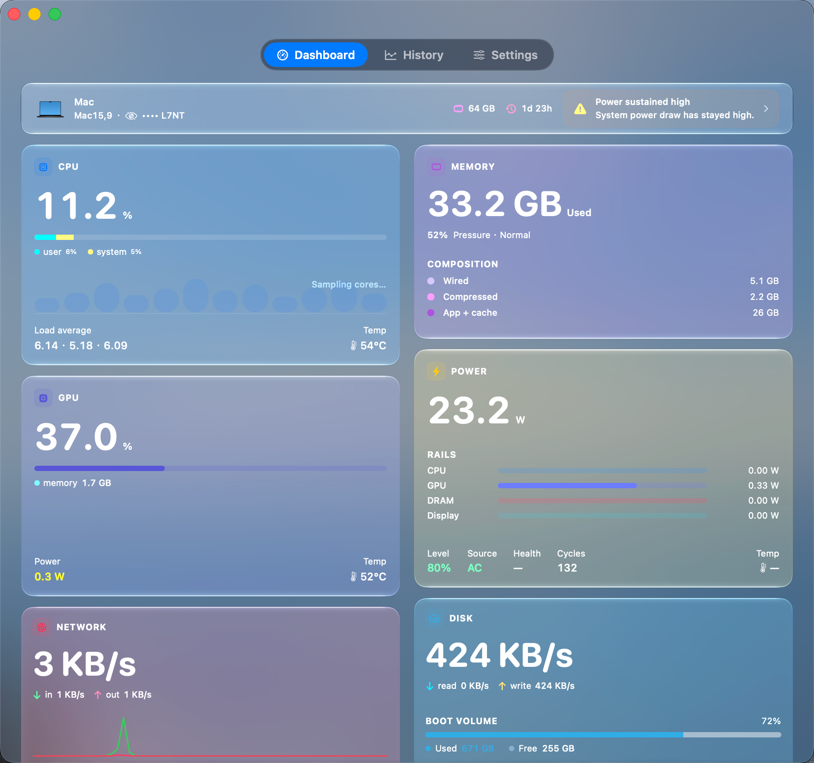

# Peakmon

[](https://github.com/crafcat7/Peakmon/releases)
[](LICENSE)

[English](README.md) · [简体中文](README.zh-CN.md)

Peakmon 是一个原生 macOS 菜单栏系统监视器，用于在菜单栏和仪表盘窗口中查看常用系统指标。

它目前支持 CPU、GPU、内存、电池、磁盘、网络和进程等实时指标。项目使用 SwiftUI 和本地 Swift packages 构建，无 Electron 外壳，无遥测上报，数据仅在本机采集和展示。

<p align="center">
  
  &nbsp;&nbsp;
  
</p>

<p align="center">
  
</p>

<p align="center">
  
</p>

## 下载

**[https://github.com/crafcat7/Peakmon/releases](https://github.com/crafcat7/Peakmon/releases)**

下载最新 `Peakmon.app.zip`，解压后拖到 `/Applications`。首次启动右键 → 打开放行。

### Homebrew

```sh
brew install crafcat7/cellar/peakmon
```

## 功能

**菜单栏** — 紧凑的 segment 布局（CPU%、内存压力、网速、GPU 利用率等），栅格化为单张图片。文字颜色自动适配菜单栏背景（深色/浅色/全屏）。

**弹窗** — 点击菜单栏图标查看 sparkline 图表、每项指标的详细数据、高占用进程列表。

**仪表盘** — 统一窗口，包含 CPU、Memory、GPU、Power、Disk、Network 等卡片。每张卡有大数字、sparkline 图表和展开详情。支持全局快捷键 `⌃⌥⌘D`。

**自定义** — 开关卡片、拖拽排序、自定义配色、选择菜单栏显示哪些指标。

## 数据来源

所有数据保留在本地，无网络请求。

| 指标 | 来源 |
|------|------|
| CPU / 内存 | `host_statistics64` (Darwin) |
| GPU 利用率 | IOAccelerator `PerformanceStatistics` (IOKit) |
| 功耗（分轨） | IOReport "Energy Model" (libIOReport, dlopen) |
| 温度 | SMC keys `Tp0X` / `Tg0D` |
| 风扇转速 | SMC key `F0Ac` |
| 电池 | IOKit `AppleSmartBattery` |
| 磁盘 | IOKit `IOBlockStorageDriver` |
| 网络 | `getifaddrs` (Darwin) |
| 进程 | `proc_pidinfo` (libproc) |

## 系统要求

- macOS **14.0** Sonoma 或更高
- 推荐 Apple Silicon；Intel 尽力支持

## 从源码构建

```sh
git clone https://github.com/crafcat7/Peakmon.git
cd Peakmon
./Tools/release.sh
```

或用 Xcode 打开 `Peakmon.xcodeproj` 直接 Run。

测试：

```sh
swift test --package-path Packages/PeakmonCore
```

## 仓库结构

```
Peakmon/                   # 应用主体（菜单栏 + 仪表盘 + 设置）
Packages/
  PeakmonCore/             # MetricKind, MetricsStore, MetricsScheduler, SMC/IOReport 桥
  PeakmonCollectors/       # 10 个 collector（CPU, GPU, Memory, Power, Thermal, Fan, Battery, Disk, Network, Processes）
  PeakmonUI/               # 共享视图（sparkline, card 模板, DashboardComponents）
```

## 许可证

[Apache License 2.0](LICENSE)
